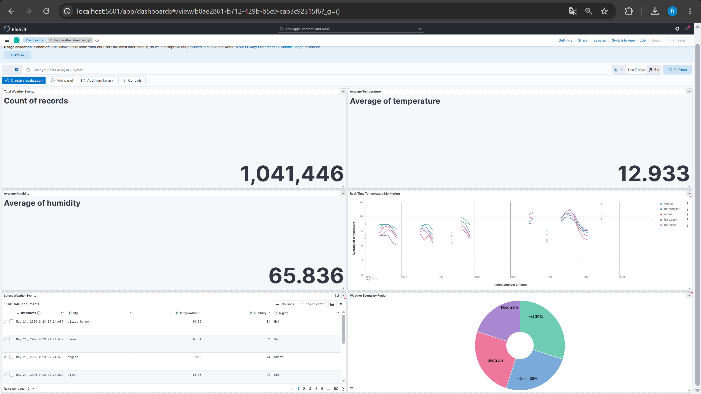

Weather App - Pipeline Météo Temps Réel

Description

Ce projet est une application de streaming de données météo en temps réel développée avec :

Spring Boot
Apache Kafka
Elasticsearch
Kibana
Docker
Kubernetes
AWS EC2

L'application récupère des données météo via l'API OpenWeather, les envoie dans Kafka, puis les indexe dans Elasticsearch afin de les visualiser dans Kibana.

Dashboard Kibana

Architecture du projet

OpenWeather API
       ↓
Spring Boot Producer
       ↓
Apache Kafka
       ↓
Spring Boot Consumer
       ↓
Elasticsearch
       ↓
Kibana Dashboard

Technologies utilisées

Java 21
Spring Boot
Apache Kafka
Elasticsearch
Kibana
Docker
Docker Compose
Kubernetes
AWS EC2
Maven

Fonctionnalités

Récupération des données météo en temps réel
Streaming des données avec Kafka
Consommation des messages Kafka
Indexation dans Elasticsearch
Visualisation dans Kibana
Déploiement avec Docker
Orchestration avec Kubernetes
Déploiement cloud sur AWS

Structure du projet

weather-app/
│
├── src/
├── k8s/
├── docker-compose.yml
├── Dockerfile
├── pom.xml
└── README.md

Lancer le projet en local

1. Cloner le projet

git clone https://github.com/dounia-lall/weather-app.git

cd weather-app

2. Lancer l'infrastructure Docker

docker-compose up -d

Services démarrés :

Kafka
Elasticsearch
Kibana

3. Construire l'application Spring Boot

mvn clean package

4. Construire l'image Docker

docker build -t weather-app .

5. Déployer avec Kubernetes

kubectl apply -f k8s/weather-deployment.yaml
kubectl apply -f k8s/weather-service.yaml
Tester l'API
curl -X POST http://localhost:30080/weather/Paris

Accès Kibana

http://localhost:5601

Déploiement AWS

Le projet peut être déployé sur une instance AWS EC2 Ubuntu avec Docker et Kubernetes.

Auteur
Dounia Lallouche