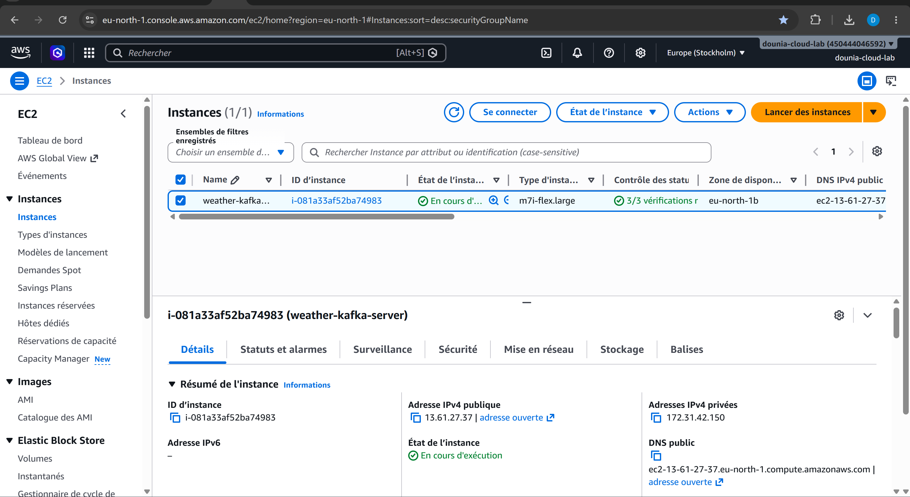
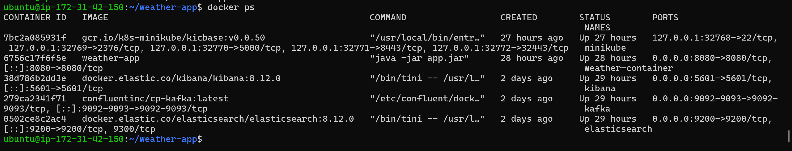
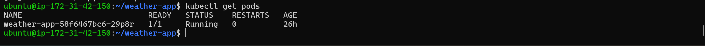

# 🌦️ Weather App - Pipeline Météo Temps Réel

## 📌 Description

Ce projet est une application de streaming de données météo en temps réel développée avec des technologies Big Data et Cloud modernes.

L’application récupère des données météo en direct via l’API OpenWeather, les transmet dans Apache Kafka, les traite avec Spring Boot, les indexe dans Elasticsearch puis les visualise dans des dashboards Kibana.

L’infrastructure Kafka, Elasticsearch et Kibana est déployée avec Docker Compose sur une instance AWS EC2, tandis que l’application Spring Boot est conteneurisée avec Docker puis déployée avec Kubernetes sur AWS EC2.

---

## 🚀 Technologies utilisées

- Java 21
- Spring Boot
- Apache Kafka
- Elasticsearch
- Kibana
- Docker
- Docker Compose
- Kubernetes
- AWS EC2
- Maven
- OpenWeather API

---

## 🏗️ Architecture du projet

```text
OpenWeather API
        ↓
Spring Boot Producer
        ↓
Apache Kafka
        ↓
Spring Boot Consumer
        ↓
Elasticsearch
        ↓
Kibana Dashboard
```

---

## ⚙️ Fonctionnalités

- ✅ Streaming météo temps réel
- ✅ Architecture Producer / Consumer Kafka
- ✅ Transmission des données avec Apache Kafka
- ✅ Traitement des données avec Spring Boot
- ✅ Indexation des données dans Elasticsearch
- ✅ Visualisation des données avec Kibana
- ✅ Conteneurisation avec Docker
- ✅ Déploiement de Kafka, Elasticsearch et Kibana avec Docker Compose
- ✅ Déploiement de l’application Spring Boot avec Kubernetes
- ✅ Déploiement cloud sur AWS EC2
- ✅ Monitoring et analyse des données météo

---

## 📊 Dashboard Kibana

Le dashboard Kibana permet de visualiser :

- 🌡️ Température moyenne des villes
- 💧 Humidité moyenne des villes
- 📈 Évolution météo en temps réel
- 🌍 Répartition des événements par région
- 📡 Nombre d’événements météo traités
- 📋 Tableau temps réel des données météo

---

## 📂 Structure du projet

```text
weather-app/
│
├── src/
├── k8s/
│   ├── weather-deployment.yaml
│   └── weather-service.yaml
│
├── screenshots/
│   ├── aws-ec2-instance-running.png
│   ├── dashboard-kibana.png
│   ├── docker-containers-running.png
│   └── kubernetes-pod-running.png
│
├── docker-compose.yml
├── Dockerfile
├── pom.xml
└── README.md
```

---

## 🐳 Lancer le projet en local

### 1️⃣ Cloner le projet

```bash
git clone https://github.com/dounia-lall/weather-app.git
cd weather-app
```

### 2️⃣ Démarrer l’infrastructure Docker

```bash
docker-compose up -d
```

Services démarrés :

- Kafka
- Elasticsearch
- Kibana

### 3️⃣ Construire l’application Spring Boot

```bash
./mvnw clean package -DskipTests
```

### 4️⃣ Construire l’image Docker

```bash
docker build -t weather-app .
```

---

## ☸️ Déploiement Kubernetes

L’application Spring Boot est conteneurisée avec Docker, puis déployée avec Kubernetes.

Déployer l’application avec Kubernetes :

```bash
kubectl apply -f k8s/weather-deployment.yaml
kubectl apply -f k8s/weather-service.yaml
```

Vérifier les pods :

```bash
kubectl get pods
```

Vérifier les services :

```bash
kubectl get services
```

---

## ☁️ Déploiement AWS EC2

Le projet a été déployé sur une instance AWS EC2 Ubuntu.

L’environnement de déploiement utilise :

- AWS EC2 comme serveur cloud
- Docker Compose pour lancer Kafka, Elasticsearch et Kibana
- Docker pour construire l’image de l’application Spring Boot
- Kubernetes pour déployer et orchestrer l’application Spring Boot
- Kibana pour visualiser les données météo indexées dans Elasticsearch

Concrètement :

- Kafka, Elasticsearch et Kibana tournent dans des conteneurs Docker via Docker Compose sur l’instance AWS EC2.
- L’application Spring Boot est conteneurisée avec Docker, puis déployée avec Kubernetes sur AWS EC2.
- Les données météo sont récupérées depuis l’API OpenWeather, envoyées dans Kafka, traitées par Spring Boot, indexées dans Elasticsearch, puis visualisées dans Kibana.

---

## 📸 Captures du déploiement

### Instance AWS EC2 en cours d’exécution

Le projet est déployé sur une instance AWS EC2 Ubuntu nommée `weather-kafka-server`.



---

### Dashboard Kibana

Visualisation des données météo dans Kibana.


---

### Services Docker actifs

Kafka, Elasticsearch et Kibana sont lancés avec Docker Compose sur l’instance AWS EC2.



---

### Pod Kubernetes en cours d’exécution

L’application Spring Boot est déployée avec Kubernetes. Le pod `weather-app` est en état `Running`.



---

## 📡 Tester l’API

```bash
curl -X POST http://localhost:30080/weather/Paris
```

---

## 📊 Accès Kibana

```text
http://localhost:5601
```

---

## 👩‍💻 Auteur

**Dounia Lallouche**

---

## ⭐ À propos

Application de streaming météo temps réel utilisant Spring Boot, Apache Kafka, Elasticsearch, Kibana, Docker, Docker Compose, Kubernetes et AWS EC2.
